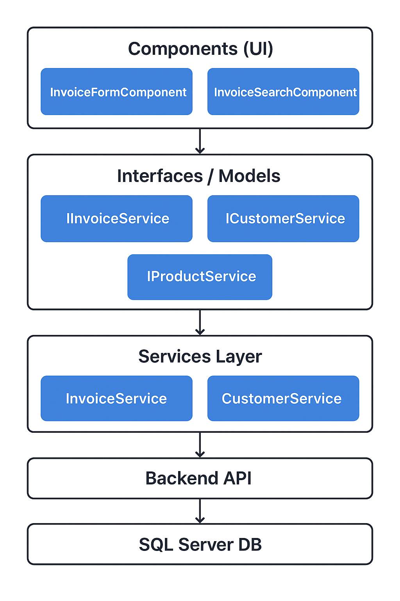
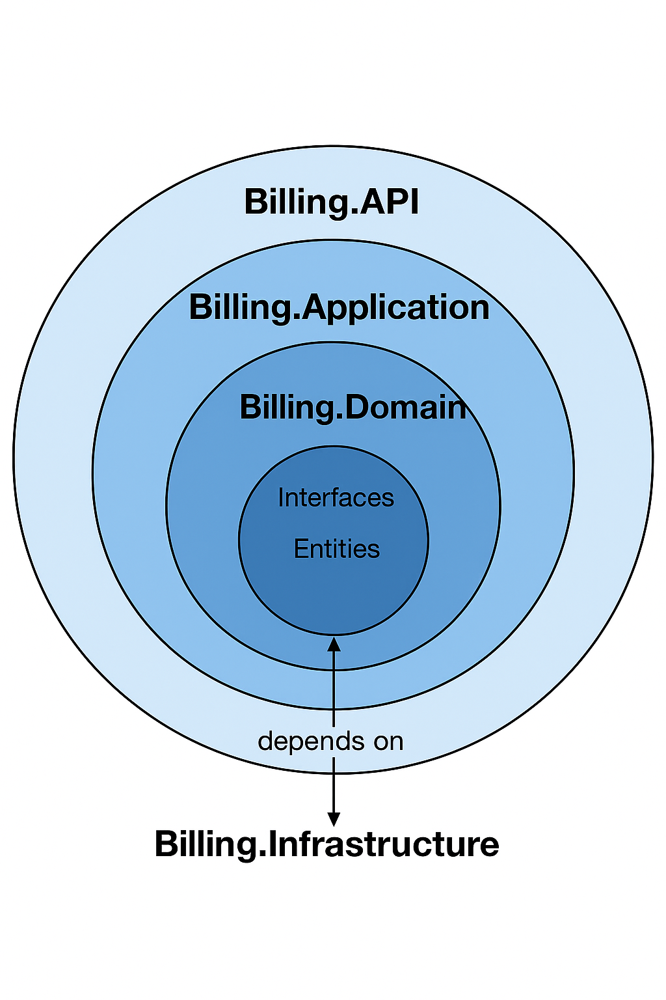

# Proyecto Billing (Backend .NET 9 + Frontend Angular 20)

## Descripción
Este proyecto es una aplicación de facturación compuesta por un backend desarrollado en .NET 9 y un frontend en Angular 20. La aplicación permite la gestión de facturas.

## Tecnologías utilizadas

- **Backend:** .NET 9
- **Frontend:** Angular 20.3.x
- **Base de datos:** SQL Server (scripts incluidos en la carpeta `/Database`)
- **Otros:** RxJS 7.8, Express (para SSR de Angular)

## Requisitos previos

- [.NET 9 SDK](https://dotnet.microsoft.com/download/dotnet/9.0)
- [Node.js](https://nodejs.org/) (versión 20 o superior)
- [Angular CLI](https://angular.io/cli) (preferiblemente 20.3.x)
- SQL Server (local o remoto)

## Configuración de la base de datos

1. Abrir SQL Server Management Studio (SSMS) o cualquier cliente de SQL.
2. Ejecutar los scripts SQL dentro de la carpeta `/Database` para crear la base de datos y las tablas necesarias.
3. Configurar la cadena de conexión en `appsettings.json` del proyecto Backend:

```json
"ConnectionStrings": {
  "DefaultConnection": "Server=localhost;Database=LabDev;User Id=developer;Password=abc123ABC;Encrypt=False;"
}
```

## Backend (.NET 9)

### Restaurar paquetes

```bash
cd backend/Billing.API
dotnet restore
```

### Ejecutar proyecto

```bash
dotnet run --project Billing.API/Billing.API.csproj
```

- La API se ejecutará por defecto en `http://localhost:5055`.
- Swagger UI estará disponible en `http://localhost:5055/swagger` para probar los endpoints.

## Frontend (Angular 20)

### Instalar dependencias

```bash
cd frontend
npm install
```

### Ejecutar proyecto en modo desarrollo

```bash
ng serve
```

- La aplicación estará disponible en `http://localhost:4200`.
- Para SSR (Server-Side Rendering) usar:

```bash
npm run dev:ssr
```

## Diagramas de arquitectura

### 1. Flujo de componentes y servicios



- Muestra cómo los componentes de Angular consumen los servicios y se conectan al backend.

### 2. Arquitectura en capas del backend



- Representa la dependencia entre las capas del backend: API, Application, Domain e Infrastructure.

## Notas adicionales

- Mantener consistentes las versiones de Angular y Angular CLI para evitar incompatibilidades.
- El backend sigue principios de arquitectura limpia y SOLID en capas (API, Application, Domain).
- Se recomienda usar un entorno virtual de Node y configurar variables de entorno para la cadena de conexión si se despliega en producción.

---

Este README proporciona instrucciones completas para ejecutar y probar tanto el backend como el frontend de la aplicación.

